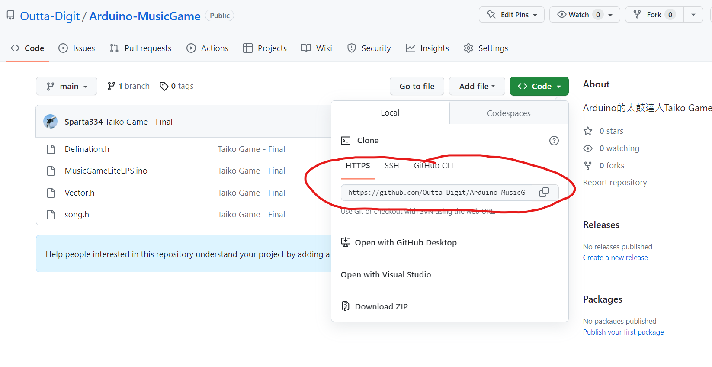

# DownloadLink
如何快速下載你的專案

*****

下載後找到 Link.bat後
1. 右鍵編輯 或 vscode 打開
2. 把 set MydirPath="C:\Ian\Outta-Digit\Arduino" 裡的 **Arduino**換成你課程的名字，這是你的資料夾
3. 找到 git clone 這條指令有兩個地方有，把**從https開始**改成你的github repositories : 
4. 叫人雙擊點開即可
5. 檔案會在D槽下的Outta-Digit

